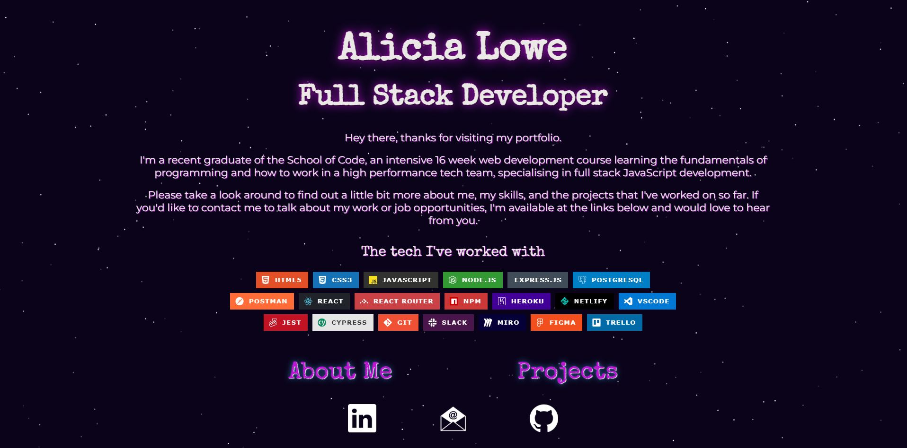

# My Portfolio

[View my live portfolio site here](https://alicialowe.netlify.app/)

## The Project and Thought Process

The brief here was simple: create myself a portfolio website to showcase myself and my work since beginning my journey into code.  

The app is quite simple intentionally, but reflecting my character in the use of the starry background and the colour template/theme, and the choice of font for the titles and links.  I've used the same font (Special Elite) in my CV and on my banner image in GitHub, and I chose it to reflect my love of writing as it reminds me of typewriter text.

I chose to use a pixel image to depict myself because honestly I'm more comfortable with that, but also I think it fits the theme and pallete as well as my personality.

Though the design isn't overly complicated, it does make use of an animated background via [tsParticles](https://particles.js.org/), which I customised to how I preferred, with a dark purple background and some stars blinking a little faster to make the animation a little clearer.  I also focussed on making the app as responsive as possible, and built in media queries to make it display better on mobile.

## Some Thoughts

Though I initially struggled with how I wanted to portray myself and my work, I'm really happy with how this came out and I'm happy with the things I learned during the build process (with responsive design in particular, but also using conditional classes for the project images).

Using tsParticles a second time round was much easier as I could copy the installation pretty much from my Among Us project, though customising the animation was different so this did take some time.

## Tech

React, React Router, HTML, CSS, JavaScript, Netlify
